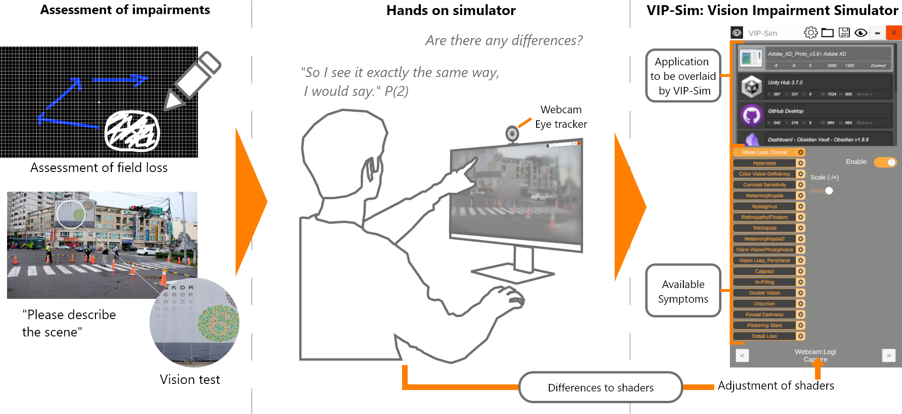

# VIP-Sim: A User-Centered Approach to Vision Impairment Simulation for Accessible Design
<!-- GitHub Topics: accessibility, visual-impairment, unity, simulation, hci, user-centered-design -->
> A gaze-contingent vision impairment simulator to support accessible design.


<p align="center">
  
</p>

---


## 🧠 Overview

**VIP‑Sim** is a symptom-based, Unity-powered desktop overlay simulator that accurately visualizes visual impairments based on real user input. Built through a **participatory design process** with **7 visually impaired participants (VIP)**, VIP‑Sim applies customizable shaders over any Windows/macOS design tool, simulating over **20 impairments** in a **gaze-contingent** manner.

People with vision impairments (VIPs) often rely on their remaining vision when interacting with user interfaces. Simulating visual impairments has proven to be an effective tool for designers, fostering awareness of the challenges faced by VIPs.
While previous research has introduced various vision impairment simulators, none have yet been developed with the direct involvement of VIPs or thoroughly evaluated from their perspective.
To address this gap, we developed VIP-Sim. This symptom-based vision simulator was created through a participatory design process tailored explicitly for this purpose, involving N=7 VIPs. The process led to the development of a symptom-based vision simulator. 21 symptoms, like field loss or light sensitivity, can be overlaid on desktop design tools. The results show that most participants felt VIP-Sim could replicate their symptoms.
VIP-Sim was received positively, but concerns about exclusion in design and comprehensiveness of the simulation remain, mainly whether it represents the experiences of other VIPs.

---

## ✨ Key Features

- 🧩 21 customizable symptom shaders (field loss, blur, glare, CVD, etc.)
- 👁️ Gaze-contingent simulation using webcam-based eye tracking
- 🧑‍🦯 Built **with and for** people with visual impairments
- 🪟 Transparent, click-through Unity overlay for any application (e.g. Figma, Adobe XD)
- ⚙️ Intuitive UI to toggle symptoms and tune severity

---

## 📦 Installation

We are currently in release 1.9.

### Prerequisites

If you want to use our shaders for your own project or use/contribute to VIP-Sim these are the Prerequisites

- Unity 2022.3.27f1 or newer
- .NET Framework ≥ 4.x
- Windows 10/11 or macOS
- A webcam (for gaze-based effects)

### 🚀 Quick Start

Download our release to to install VIP-Sim to your system.
Note that the Mac-OS version does need a manual adjustement to the access rights for screen recording.

### 🎓 Tutorial

<p align="center">
  
</p>
The notebooks/tutorial.ipynb or docs/tutorial.md walks through:

Installing and running VIP-Sim

Applying shaders and tuning symptoms

Integrating with design tools

Simulating specific user diagnoses

### 🔍 Shader Examples
# Overview of Shaders in VIP-Sim

| Shader Name                 | Eye Tracking Required | Parameters                                                                 |
|----------------------------|-----------------------|---------------------------------------------------------------------------|
| Central Vision Loss        | ✅ Yes                | Size (0 to full screen size)                                               |
| Hyperopia                  | ❌ No                 | Visual acuity in CPD (0.01–30)                                             |
| Color Vision Deficiency    | ❌ No                 | Type (Protanomaly, Deuteranomaly, Tritanomaly, Monochrome), Severity (0–100%) |
| Contrast Sensitivity       | ❌ No                 | Brightness (-1 to 1), Contrast (-1 to 1), Gamma (0 to 1)                   |
| Metamorphopsia Pointwise   | ✅ Yes                | –                                                                         |
| Nystagmus                  | ❌ No                 | Speed (0–1 s), Amplitude (0–20% of screen width)                          |
| Retinopathy / Floaters     | ✅ Yes                | Color, Opacity, Density, Speed, Centering, Radius                         |
| Teichopsia                 | ✅ Yes                | Strength (0–1)                                                            |
| Metamorphopsia Overlay     | ❌ No                 | Speed, Frequency, Amplitude (each 0–1)                                    |
| Glare / Photophobia        | ❌ No                 | Intensity, Blur, Threshold (each 0–1)                                     |
| Peripheral Vision Loss     | ✅ Yes                | Size (0 to full screen size)                                              |
| Cataracts                  | ❌ No                 | Severity (0–1), Frosting                                                  |
| In-Filling                 | ✅ Yes                | Size (0 to ¼ of screen size)                                              |
| Double Vision              | ❌ No                 | Displacement (0 to ¼ of screen size)                                      |
| Distortion                 | ✅ Yes                | Radius, Suction Strength, Inner Radius, Noise Amount                      |
| Foveal Darkness            | ✅ Yes                | Size, Fade, Opacity (each 0–1)                                            |
| Flickering Stars           | ❌ No                 | Radius, Fade                                                              |
| Detail Loss                | ❌ No                 | Severity via number of clusters (10 to 1000)                              |

Example shader settings of our participants:

<p align="center">
  
</p>

### 📈 Changelog
View all updates in CHANGELOG.md

### 🙌 Contributing
We welcome bug reports, shader improvements, and new symptom contributions!

# 📝 Citation
If you use VIP-Sim in academic work, please cite:

```
@inproceedings{Raedler2025VIPSIM,
  title     = {{VIP-Sim: A User-Centered Approach to Vision Impairment Simulation for Accessible Design}},
  author    = {Max Rädler and Mark Colley and Enrico Rukzio},
  booktitle = {Proceedings of the 38th ACM Symposium on User Interface Software and Technology (UIST ’25)},
  year      = {2025},
  publisher = {ACM},
  doi       = {10.1145/3746059.3747704},
  url       = {https://doi.org/10.1145/3746059.3747704}
}
```

# 📄 License
This project is licensed under CC BY 4.0

# 📬 Contact
Max Rädler – max.raedler@uni-ulm.de
Mark Colley - m.colley@ucl.ac.uk

Project Repository: github.com/Max-Raed/VIP-Sim
